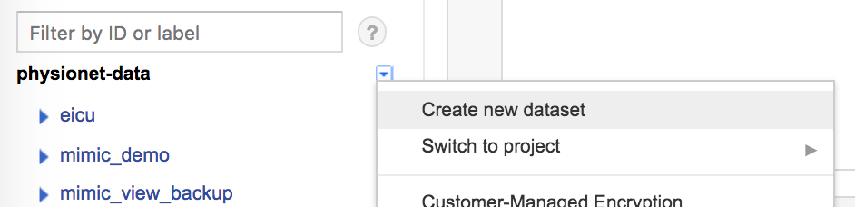
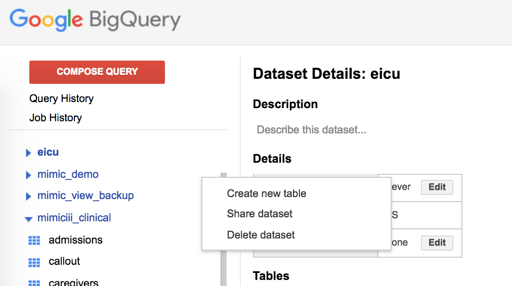
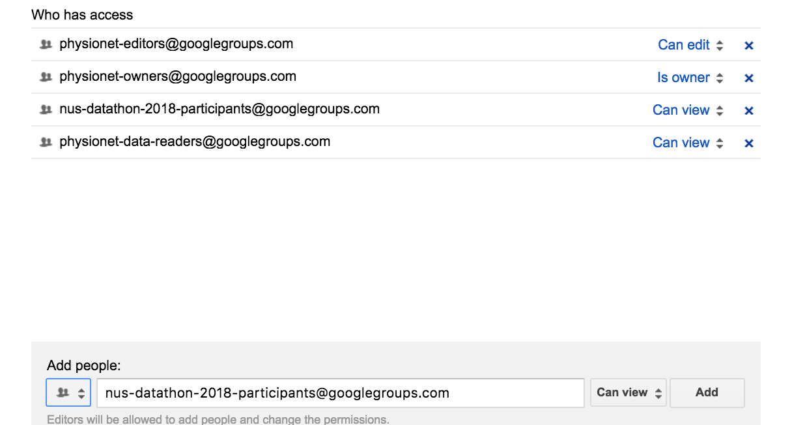
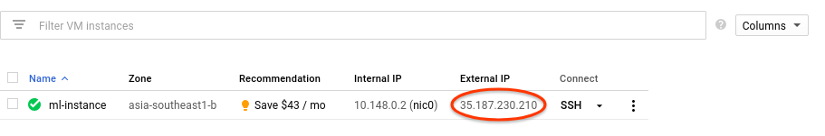

# Using Google Cloud Platform (GCP) for MIMIC-III and eICU Database

07/09/2018

Wei-Hung Weng

In the `physionet-data` project, we already uploaded the following schema:

- [`eicu`](https://bigquery.cloud.google.com/dataset/physionet-data:eicu)
- [`mimic_demo`](https://bigquery.cloud.google.com/dataset/physionet-data:mimic_demo)
- [`mimiciii_clinical`](https://bigquery.cloud.google.com/dataset/physionet-data:mimiciii_clinical)
- [`mimiciii_clinical_backup`](https://bigquery.cloud.google.com/dataset/physionet-data:mimiciii_clinical_backup) (without duplication issue in `mimiciii_clinical`)
- [`mimiciii_notes`](https://bigquery.cloud.google.com/dataset/physionet-data:mimiciii_notes) (We normally don't grant people the access to notes.)

## Create / Setup the Project and Upload the Dataset (MIT LCP)

Please refer to the [GCP instructions for organizers](https://github.com/GoogleCloudPlatform/healthcare/tree/master/datathon/organizer) to setup the projects, host datasets and construct the environment.

The detailed information of using BigQuery tables can be found in the [Google Cloud documentation](https://cloud.google.com/bigquery/docs/tables-intro).
[Google Cloud SDK](https://cloud.google.com/sdk/install) is required for this step. 

## Setup the Permission

### For Students/Participants

Provide your gmail to the event manager.
Once receiving the mail of Google Group invitation, accept it.

Please skip the following sections and directly go to the Access the dataset section below.

### For the Event Manager (course/workshop instructor, datathon organizer)

Please create the new group and grant participants the permission to use datasets using [Google Groups](https://groups.google.com/).

- Create group
- Define group name and email address, leave other things default
- Let the MIT person know the group email address
- Add all your participants (gmail) into the gruop

* Click on "My Groups"
* Click on "manage" for your team group
* Click on direct add members on the left
* Add your team members' gmail address and type a welcome message

If needed, the event manager may create more than one team groups and create the project space for each group.

If the participants are interested in using cloud-based RStudio, please create the virtual machine with [Google Computing Engine](https://cloud.google.com/compute/).
However, only single user can login into one VM at the same time. (?)

http://grantmcdermott.com/2017/05/30/rstudio-server-compute-engine/

### For On-site MIT Person

First, please ask MIT LCP to grant you the role of `physionet-owners`. 
This owner status is necessary for you to grant all participants (the event Google Group gmail) the permission to access dataset under `physionet-data` and create new datasets under their own spaces.

Please go to [Google Cloud Platform / physionet-data / storage](https://console.cloud.google.com/storage/browser?project=physionet-data). 
For the datasets you want to provide in the event, go to "Edit bucket permissions" and make sure that:

- `physionet-owners` in storage admin
- `physionet-editors` in storage object creator
- `physionet-data-readers` in storage object viewer

(not quite sure)

To enable participant dataset access, go to [BigQuery](https://bigquery.cloud.google.com/), add the group gmail to the Share dataset. Remember to select "Group by e-mail", add the gmail as "Can view".

Before course or datathon, ONLY provide the participants the access to `mimic_demo`.
On the first day of the event, open the access to `eicu` and `mimiciii_clinical`.

## Access the Dataset

For the BigQuery-supported SQL syntax, refer to [the webpage](https://cloud.google.com/bigquery/docs/reference/standard-sql/).

### Python
For python users, refer to [GCP tutorial for python](tutorial_py.ipynb).

Using [Google colab platform](https://colab.research.google.com/) is suggested. 
Check the [GCP tutorial using colab](http://colab.research.google.com/github/GoogleCloudPlatform/healthcare/blob/master/datathon/nusdatathon18/tutorials/bigquery_tutorial.ipynb). 

### R
For R users, refer to [GCP tutorial for R](tutorial_R.Rmd).

To use the RStudio environment, 

- Go to [Google Computing Engine console](https://console.cloud.google.com/compute/instances?project=datathon-client-00) and find the server IP at "External IP" of GCE instances. 
- Visit `http://EXTERNAL_IP:8787` (e.g. `http://35.192.32.36:8787`).
- Username and password will be provided by instructors/organizers (default: `r-user/password`, `analystX/analystX`)

### User Interface
For people who don't use either python or R, BigQuery UI helps you query the database oneline and the result table can be exported as CSV files and then processed by other tools.

#### Make SQL Query
You may make a SQL query in the "New Query" box, then "RUN QUERY". 
Once the result is shown, you can decide if you want to download the table, or save the table to your cloud working space.

#### Create New Dataset
You can create your project through BigQuery console. 

- Click the down arrow icon next to your project name, then click "Create new dataset".
- Use default setting.

#### Import Data

- Hover on the dataset name, and click on the plus icon.
- Select "Create from source" option.
- Select "File upload" for location, and click "Choose file" button to select the file(s) to import. Make sure the "File format" field matches your file(s) to import.
- Choose a table name.
- Select "Automatically detect" for schema.
- Leave the default value for all other options.
- The new table can be queried as `<project id>:<dataset name>.<table name>`.

For detailed instruction and SQL examples, refer to the [GCP instructions of using UI](tutorial_ui.md).
